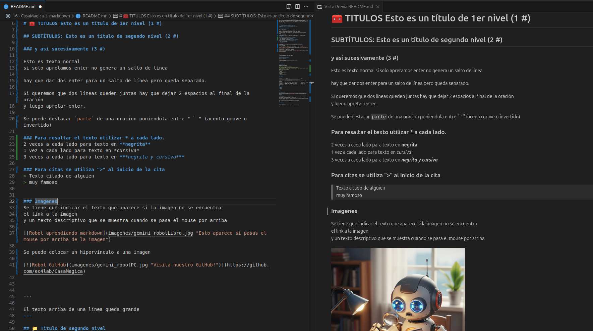

Hola!, esto es un compilado de ejemplos básicos para ecribir en markdown, la forma más sencilla que encontramos hasta ahora es utilizando VSCode (por las dudas VSCode no nos paga nada, igual mal no estaría 😉 ), en donde podemos ver el texto raw y el final de manera simultánea.



A lo largo del documento, indicaremos el texto sin formato y a continuación la salida para tener la referencia, puedes también desargar el README.md y analizarlo directamente en tu VSCode. 
Cualquier mejora o formato que se nos haya pasado por algo no dudes en contactarnos.


# 🧰 Títulos
los títulos se generar colocando '#' delante del renglón, a medida que agreges más '#' iras incrementando el nivel del subtítulo
```
# Esto es un título de 1er nivel (1 #)  
```
#  Esto es un título de 1er nivel (1 #)
```
## SUBTÍTULOS: Esto es un título de segundo nivel (2 #)  
```
## SUBTÍTULOS: Esto es un título de segundo nivel (2 #)
```
### y así sucesivamente (3 #)  
```
### y así sucesivamente (3 #)
```
Esto es texto normal
si solo apretamos enter no genera un salto de linea

hay que dar dos enter para un salto de línea pero queda separado.

Si queremos que dos líneas queden juntas hay que dejar 2 espacios al final de la oración  
y luego apretar enter.
```

Esto es texto normal
si solo apretamos enter no genera un salto de linea

hay que dar dos enter para un salto de línea pero queda separado.

Si queremos que dos líneas queden juntas hay que dejar 2 espacios al final de la oración  
y luego apretar enter.

```
Se puede destacar `parte de una oración` poniendola entre " \` "  
(acento grave o invertido)
```
Se puede destacar `parte de una oración` poniendola entre " \` "  
(acento grave o invertido)

# 🖍️ Resaltar Texto
```
**Negrita**  
*Cursiva*  
***Negrita y cursiva***  
<del>tachado</del>  
~~tachado~~  
<ins>subrayado</ins>  
a<sub>subindice</sub>  
a<sup>superindice</sup>  
<samp>Monospace</samp>  
<table><tr><td>Recuadro</td></tr></table>  
<kbd>Boton</kbd>    

<code>Resaltado</code>  
`Resaltado`
```

**Negrita**  
*Cursiva*  
***Negrita y cursiva***  
<del>tachado</del>  
~~tachado~~  
<ins>subrayado</ins>  
a<sub>subindice</sub>  
a<sup>superindice</sup>  
<samp>Monospace</samp>  
<table><tr><td>Recuadro</td></tr></table>  
<kbd>Boton</kbd>    

<code>Resaltado</code>  
`Resaltado`

# 🎗️ Citas
Para citas se utiliza ">" al inicio de la cita  
```
> Texto citado de alguien  
> muy famoso
```
> Texto citado de alguien  
> muy famoso

# ⤵️ Texto Desplegable

```
<details>
    <summary>Texto Desplegable</summary>
    Texto que se despliega con el click
</details>
```

<details>
    <summary>Texto Desplegable</summary>
    Texto que se despliega con el click
</details>

<br/>

# 🖼️ Imágenes
* Se tiene que indicar el texto que aparece si la imagen no se encuentra,  
* el link a la imagen, (puede ser dentro del repo o web) 
* y un texto descriptivo que se muestra cuando se pasa el mouse por arriba  
```
  
> Imagen generada por un modelo de IA de Google 
```
  
> Imagen generada por un modelo de IA de Google  

```
  
```
  


## Se puede colocar un `hipervínculo` a una imagen  
```
[](https://github.com/ec4lab/LandPAge)  
> Imagen generada por un modelo de IA de Google 
```
[](https://github.com/ec4lab/LandPAge)  
> Imagen generada por un modelo de IA de Google 

# 📏 Líneas  

Podemos hacer una línea colocando 3 " - " seguidos
```
---
```
---


```
El texto normal arriba de una línea queda grande
---
```


El texto normal arriba de una línea queda grande
---

# 🧑‍💻 Código

Podemos formatear un párrafo como código poniendo 3 " ` " antes y después del párrafo.

## Código sin formato:  

\```  
#Comentario del código  
C:\Users\VsCode\Programas\ejemplo_git  
\```

```
#Comentario del código
C:\Users\VsCode\Programas\ejemplo_git
```
## Lenguaje del código
Podemos indicar el tipo de código inmediatamente después de los 3 " `" superiores:

### Código en consola (bash):  

\```bash  
#Nos movemos a la carpeta del proyecto  
cd C:\Users\VsCode\Programas\ejemplo_git  
#Creamos el entorno virtual ".venv" técnicamente podría tomar   
cualquier nombre, pero es una buena práctica utlizar .venv  
python -m venv .venv #en Ubuntu  
\```

```bash
#Nos movemos a la carpeta del proyecto
cd C:\Users\VsCode\Programas\ejemplo_git
#Creamos el entorno virtual ".venv" técnicamente podría tomar cualquier nombre, pero es una buena práctica utlizar .venv
python -m venv .venv #en Ubuntu
```
### Código python:
\```python  
import pandas as pd  
#comentario de python  
def main():  
    print('Hola mundo')  
\```

```python
import pandas as pd
#comentario de python
def main():
    print('Hola mundo')
```

# 🗓️ Tablas:
Se hacen poniendo " | "
```
|Licencia|Qué permite|Ideal si...|  
|---|---|---|  
|MIT|Cualquiera puede usar/modificar/comercializar|Querés algo libre y flexible|  
|GPLv3|Libre, pero obliga a compartir mejoras|Querés que las mejoras sean públicas|  
|Apache 2.0|Como MIT, pero protege contra patentes|Proyecto serio o empresarial|  
|Sin licencia|Legalmente, nadie puede usar tu código|Lo dejás para vos|  
```

|Licencia|Qué permite|Ideal si...|  
|---|---|---|  
|MIT|Cualquiera puede usar/modificar/comercializar|Querés algo libre y flexible|  
|GPLv3|Libre, pero obliga a compartir mejoras|Querés que las mejoras sean públicas|  
|Apache 2.0|Como MIT, pero protege contra patentes|Proyecto serio o empresarial|  
|Sin licencia|Legalmente, nadie puede usar tu código|Lo dejás para vos|  

### Se puede alinear el texto dentro de cada columna colocando " : " en la fila de las líneas:  
```
|si no ponemos nada|si ponemos " : " a ambos lados|si ponemos " : " al final|  
|---|:---:|---:|  
|izquierda|centrado|derecha|
```


|si no ponemos nada|si ponemos " : " a ambos lados|si ponemos " : " al final|
|---|:---:|---:|
|izquierda|centrado|derecha|


# 🧾 Listas
solo hay que iniciar la oración con " * "  
```
* item 1  
* item 2  
* item 3
    * item 3.1
        * item 3.1.b
```

* item 1
* item 2
* item 3
    * item 3.1
        * item 3.1.b

## Listas de tareas
```
- [x] Redactar README.md
- [ ] Actualizar Links
- [ ] Hacer BackUps
- [ ] \(Opcional) Renombrar imágenes
```

- [x] Redactar README.md
- [ ] Actualizar Links
- [ ] Hacer BackUps
- [ ] \(Opcional) Renombrar imágenes

# 📫 Hypervínculos

```
Muchos ejemplos que se ven aquí fueron tomados de tutotialmarkdown.com  
Tutorial sintaxis de Markdown: [tutorialmarkdown.com](https://tutorialmarkdown.com/sintaxis)

mas ejemplos:[Github-Markdown.md](https://gist.github.com/nikhilnayyar002/7a35e653d3d590e317c829243e73b110
```

Muchos ejemplos que se ven aquí fueron tomados de tutotialmarkdown.com  
Tutorial sintaxis de Markdown: [tutorialmarkdown.com](https://tutorialmarkdown.com/sintaxis)

mas ejemplos:[Github-Markdown.md](https://gist.github.com/nikhilnayyar002/7a35e653d3d590e317c829243e73b110)


# 🧮 Ecuaciones y matrices

## Con corchetes
```
$$  
R_1^0 =  
\begin{bmatrix}  
x_1.x_0 & y_1.x_0 & z_1.x_0 \\  
x_1.y_0 & y_1.y_0 & z_1.y_0 \\  
x_1.z_0 & y_1.z_0 & z_1.z_0 \\  
\end{bmatrix}  
$$
```
$$
R_1^0 =
\begin{bmatrix}
x_1.x_0 & y_1.x_0 & z_1.x_0 \\
x_1.y_0 & y_1.y_0 & z_1.y_0 \\
x_1.z_0 & y_1.z_0 & z_1.z_0 \\
\end{bmatrix}
$$

## Sin Corchetes
```
$$  
R_1^0 =  
\begin{matrix}  
x_1.x_0 & y_1.x_0 & z_1.x_0 \\  
x_1.y_0 & y_1.y_0 & z_1.y_0 \\  
x_1.z_0 & y_1.z_0 & z_1.z_0 \\  
\end{matrix}  
$$
```

$$
R_1^0 =
\begin{matrix}
x_1.x_0 & y_1.x_0 & z_1.x_0 \\
x_1.y_0 & y_1.y_0 & z_1.y_0 \\
x_1.z_0 & y_1.z_0 & z_1.z_0 \\
\end{matrix}
$$

## Sub índices
```
En donde x<sub>0</sub>,y<sub>0</sub> y z<sub>0</sub>, son los vectores unitarios del sistema de referencia y x<sub>1</sub>,y<sub>1</sub> y z<sub>1</sub>, son los vectores unitarios del sistema rotado
```

En donde x<sub>0</sub>,y<sub>0</sub> y z<sub>0</sub>, son los vectores unitarios del sistema de referencia y x<sub>1</sub>,y<sub>1</sub> y z<sub>1</sub>, son los vectores unitarios del sistema rotado

## Sub índices II
```
Podemos Calcular $PB_{(X,Y,Z)}$ si pasamos el $PA_{(X,Y,Z)}$ por la matriz de rotación. (producto escalar). Y viceversa, por ser un giro de 180º, no aplicaría igual si θ ≠ 180
```

Podemos Calcular $PB_{(X,Y,Z)}$ si pasamos el $PA_{(X,Y,Z)}$ por la matriz de rotación. (producto escalar). Y viceversa, por ser un giro de 180º, no aplicaría igual si θ ≠ 180

## Igualdades
```
$$ p^0 = R^0_1.p^1\$$
```

$$ p^0 = R^0_1.p^1$$

```
$$
\begin{bmatrix}
\cos\phi  & 0  & sin\phi\\
0           & 1  & 0 \\
-\sin\phi  & 0  & \cos\phi\\
\end{bmatrix}
\begin{bmatrix}
\cos\theta  & -sin\theta  & 0\\
\sin\theta  & cos\theta   & 0 \\
0           & 0           & 1 \\
\end{bmatrix}
$$
$$=$$
$$
\begin{bmatrix}
\cos\phi\cos\theta  & -cos\phi\sin\theta  & 0\\
\sin\theta  & cos\theta   & 0 \\
\sin\phi\cos\theta           & \sin\phi\sin\theta           & \cos\phi \\
\end{bmatrix}
$$
```

$$
\begin{bmatrix}
\cos\phi  & 0  & sin\phi\\
0           & 1  & 0 \\
-\sin\phi  & 0  & \cos\phi\\
\end{bmatrix}
\begin{bmatrix}
\cos\theta  & -sin\theta  & 0\\
\sin\theta  & cos\theta   & 0 \\
0           & 0           & 1 \\
\end{bmatrix}
$$
$$=$$
$$
\begin{bmatrix}
\cos\phi\cos\theta  & -cos\phi\sin\theta  & 0\\
\sin\theta  & cos\theta   & 0 \\
\sin\phi\cos\theta           & \sin\phi\sin\theta           & \cos\phi \\
\end{bmatrix}
$$

En algunos editores md es posible poner las ecuaciones de arriba en una sola línea reemplazando `$$=$$`por `=`, pero en el caso de GitHub no lo reconoce y es necesario colocar la igualdad debajo.

```
El orden es importante si alteramos el orden de las rotaciones, la matriz resultante será diferente:  

$$R_{z,θ}.R_{y,Φ}=R'$$

<p align="center">
R<sub>z,θ</sub>.R<sub>y,Φ</sub> = R'
</p>
```
El orden es importante si alteramos el orden de las rotaciones, la matriz resultante será diferente:  

$$R_{z,θ}.R_{y,Φ}=R'$$

<p align="center">
R<sub>z,θ</sub>.R<sub>y,Φ</sub> = R'
</p>


## Fracciones 
$$1/2 = 8/\cos\theta$$
## Raices
```
$$\sqrt{2-2i}$$
```
$$\sqrt{2-2i}$$

```
$$^3\sqrt{2-2i}$$
```
$$^3\sqrt{2-2i}$$


# 📝 Licencia

Este proyecto está licenciado bajo la Licencia MIT.  
Podés usar, copiar, modificar y distribuir el software libremente, siempre que incluyas el aviso de derechos de autor original.
```
Para más información, consultá el archivo [LICENSE]\(LICENSE).  
```
Para más información, consultá el archivo [LICENSE](LICENSE).

# 📨 Contacto

**EC4lab**  
[GitHub: ec4lab](https://github.com/ec4lab/LandPage)


