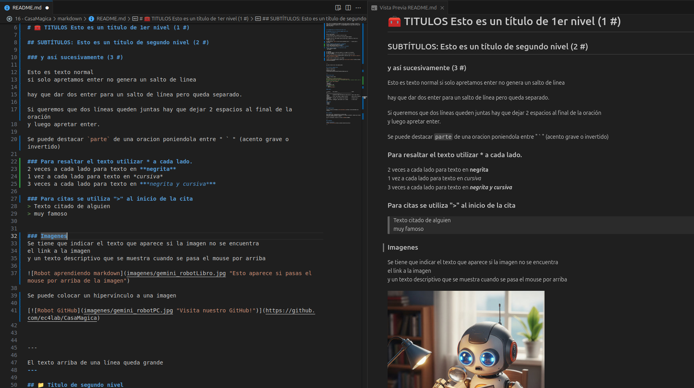
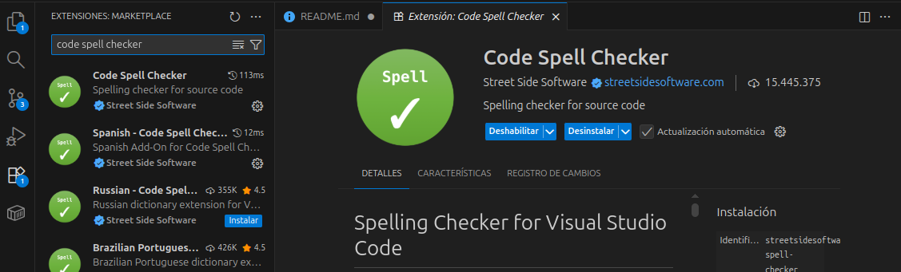
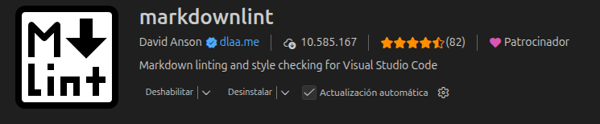

# Markdown

Hola!, esto es un compilado de ejemplos básicos para escribir en markdown, la forma más sencilla que encontramos hasta ahora es utilizando VSCode (por las dudas VSCode no nos paga nada, igual mal no estaría 😉 ), en donde podemos ver el texto raw y el final de manera simultánea.



A lo largo del documento, indicaremos el texto sin formato y a continuación la salida para tener la referencia, puedes también descargar el README.md y analizarlo directamente en tu VSCode.  
Cualquier mejora o formato que se nos haya pasado por algo no dudes en contactarnos.

## Títulos

los títulos se generar colocando '#' delante del renglón, a medida que se agreguen más '#' se va incrementando el nivel del subtítulo

```text
# Markdown
```

El título de 1er nivel (1 #), solo debe usarse una vez, en el encabezado, debajo siempre agregar subniveles:

```text
## SUBTÍTULOS: Esto es un título de segundo nivel (2 #)  
```

## SUBTÍTULOS: Esto es un título de segundo nivel (2 #)

```text
### y así sucesivamente (3 #)  
```

### y así sucesivamente (3 #)

```text
Esto es texto normal
si solo apretamos enter no genera un salto de linea

hay que dar dos enter para un salto de línea pero queda separado.

Si queremos que dos líneas queden juntas hay que dejar 2 espacios al final de la oración  
y luego apretar enter.
```

Esto es texto normal
si solo apretamos enter no genera un salto de linea

hay que dar dos enter para un salto de línea pero queda separado.

Si queremos que dos líneas queden juntas hay que dejar 2 espacios al final de la oración  
y luego apretar enter.

```text
Se puede destacar `parte de una oración` poniéndola entre " \` "  
(acento grave o invertido)
```

Se puede destacar `parte de una oración` poniéndola entre " \` "  
(acento grave o invertido)

## Resaltar Texto

```text
**Negrita**  
*Cursiva*  
***Negrita y cursiva***  
<del>tachado</del>  
~~tachado~~  
<ins>subrayado</ins>  
a<sub>subíndice</sub>  
a<sup>super índice</sup>  
<samp>Monospace</samp>  
<table><tr><td>Recuadro</td></tr></table>  
<kbd>Botón</kbd>    

<code>Resaltado</code>  
`Resaltado`
```

**Negrita**  
*Cursiva*  
***Negrita y cursiva***  
<del>tachado</del>  
~~tachado~~  
<ins>subrayado</ins>  
a<sub>sub indice</sub>  
a<sup>super indice</sup>  
<samp>Monospace</samp>  

<table><tr><td>Recuadro</td></tr></table>

<kbd>Botón</kbd>  

<code>Resaltado</code>  
`Resaltado`

## Alertas

```text
Consejo:
> [!TIP]  
> Esto es un consejo

importante:
> [!IMPORTANT]  
> Esto es importante  

Advertencia
> [!WARNING]  
> Esto es una advertencia

Notas:
> [!NOTE]
> Acá va una nota

Cuidado:
> [!CAUTION]
> Hay que tener cuidado con esto

```

Consejo:
> [!TIP]  
> Esto es un consejo

importante:
> [!IMPORTANT]  
> Esto es importante  

Advertencia
> [!WARNING]  
> Esto es una advertencia

Notas:
> [!NOTE]
> Acá va una nota

Cuidado:
> [!CAUTION]
> Hay que tener cuidado con esto

## Citas

Para citas se utiliza ">" al inicio de la cita  

```text
> Texto citado de alguien  
> muy famoso
```

> Texto citado de alguien  
> muy famoso

## Texto Desplegable

```text
<details>
    <summary>Texto Desplegable</summary>
    Texto que se despliega con el click
</details>
```

<details>
    <summary>Texto Desplegable</summary>
    Texto que se despliega con el click
</details>
<br/>

```text
<details>
  <summary><h2>Texto Desplegable con formatos</h2></summary>
  Se puede agregar otros campos

  ||||
  |---|---|---|
  |a|b|c|
  
  y también hacer cosas pero ya hay que programar en html
  <br/><h3>Como por ejemplo tablas</h2>
  <table>
  <tr>
    <th>LETRA</th>
    <th>NÚMERO</th>
  </tr>
  <tr>
    <td>A</td>
    <td>1</td>
  </tr>
  <tr>
    <td>B</td>
    <td>2</td>
  </tr>
</table>
<h3>O imágenes</h2>

</details>
<br/>
```

<details>
  <summary><h2>Texto Desplegable con formatos</h2></summary>
  Se puede agregar otros campos

  ||||
  |---|---|---|
  |a|b|c|
  
   y también hacer cosas pero ya hay que programar en html
  <br/><h3>Como por ejemplo tablas</h2>
  <table>
  <tr>
    <th>LETRA</th>
    <th>NÚMERO</th>
  </tr>
  <tr>
    <td>A</td>
    <td>1</td>
  </tr>
  <tr>
    <td>B</td>
    <td>2</td>
  </tr>
</table>
<h3>O imágenes</h2>

</details>
<br/>

## Imágenes

* Se tiene que indicar el texto que aparece si la imagen no se encuentra,  
* el link a la imagen, (puede ser dentro del repo o web)
* y un texto descriptivo que se muestra cuando se pasa el mouse por arriba  

```text
  
> Imagen generada por un modelo de IA de Google 
```

  
> Imagen generada por un modelo de IA de Google  

```text
  
```

  

### Se puede colocar un `hipervínculo` a una imagen  

```text
[](https://github.com/ec4lab/LandPAge)  
> Imagen generada por un modelo de IA de Google 
```

[](https://github.com/ec4lab/LandPAge)  
> Imagen generada por un modelo de IA de Google

### Se puede dar formato con `html`

```text
<p align="center">

</p>

```

<p align="center">

</p>

## Líneas  

Podemos hacer una línea colocando 3 " - " seguidos

```text
---
```

---

```text
El texto normal arriba de una línea queda grande
---
```

## Código

Podemos formatear un párrafo como código poniendo 3 " ` " antes y después del párrafo.

### Código sin formato  

Para escribir código sin formato específico y para que markdownlint no nos rete, debemos colocar `text`

\```text  
\#Comentario del código  
C:\Users\VsCode\Programas\ejemplo_git  
\```

```text
#Comentario del código
C:\Users\VsCode\Programas\ejemplo_git
```

### Lenguaje del código

Podemos indicar el tipo de código inmediatamente después de los 3 " `" superiores:

#### Código en consola (bash)

\```bash  
\#Nos movemos a la carpeta del proyecto  
cd C:\Users\VsCode\Programas\ejemplo_git  
\#Creamos el entorno virtual ".venv" técnicamente podría tomar  
cualquier nombre, pero es una buena práctica utilizar .venv  
python -m venv .venv #en Ubuntu  
\```

```bash
#Nos movemos a la carpeta del proyecto
cd C:\Users\VsCode\Programas\ejemplo_git
#Creamos el entorno virtual ".venv" técnicamente podría tomar cualquier nombre, pero es una buena práctica utilizar .venv
python -m venv .venv #en Ubuntu
```

#### Código python

\```python  
import pandas as pd  
\#comentario de python  
def main():  
    print('Hola mundo')  
\```

```python
import pandas as pd
#comentario de python
def main():
    print('Hola mundo')
```

## Tablas

Se hacen poniendo " | "

```text
|Licencia|Qué permite|Ideal si...|  
|---|---|---|  
|MIT|Cualquiera puede usar/modificar/comercializar|Algo libre y flexible|  
|GPLv3|Libre, pero obliga a compartir mejoras|Las mejoras sean públicas|  
|Apache 2.0|Como MIT, pero protege contra patentes|Proyecto serio o empresarial|  
|Sin licencia|Legalmente, nadie puede usar tu código|Lo dejas para vos|  
```

|Licencia|Qué permite|Ideal si...|  
|---|---|---|  
|MIT|Cualquiera puede usar/modificar/comercializar|Algo libre y flexible|  
|GPLv3|Libre, pero obliga a compartir mejoras|Las mejoras sean públicas|  
|Apache 2.0|Como MIT, pero protege contra patentes|Proyecto serio o empresarial|  
|Sin licencia|Legalmente, nadie puede usar tu código|Lo dejas para vos|  

### Se puede alinear el texto dentro de cada columna colocando " : " en la fila de las líneas

```text
|si no ponemos nada|si ponemos " : " a ambos lados|si ponemos " : " al final|  
|---|:---:|---:|  
|izquierda|centrado|derecha|
```

|si no ponemos nada|si ponemos " : " a ambos lados|si ponemos " : " al final|
|---|:---:|---:|
|izquierda|centrado|derecha|

## Listas

solo hay que iniciar la oración con " * "  

```text
* item 1  
* item 2  
* item 3
    * item 3.1
        * item 3.1.b
```

* item 1
* item 2
* item 3
  * item 3.1
    * item 3.1.b

## Listas de tareas

```text
* [x] Redactar README.md
* [ ] Actualizar Links
* [ ] Hacer BackUps
* [ ] \(Opcional) Renombrar imágenes
```

* [x] Redactar README.md
* [ ] Actualizar Links
* [ ] Hacer BackUps
* [ ] \(Opcional) Renombrar imágenes

## Ecuaciones y matrices

### Con corchetes

```text
$$  
R_1^0 =  
\begin{bmatrix}  
x_1.x_0 & y_1.x_0 & z_1.x_0 \\  
x_1.y_0 & y_1.y_0 & z_1.y_0 \\  
x_1.z_0 & y_1.z_0 & z_1.z_0 \\  
\end{bmatrix}  
$$
```

$$
R_1^0 =
\begin{bmatrix}
x_1.x_0 & y_1.x_0 & z_1.x_0 \\
x_1.y_0 & y_1.y_0 & z_1.y_0 \\
x_1.z_0 & y_1.z_0 & z_1.z_0 \\
\end{bmatrix}
$$

### Sin Corchetes

```text
$$  
R_1^0 =  
\begin{matrix}  
x_1.x_0 & y_1.x_0 & z_1.x_0 \\  
x_1.y_0 & y_1.y_0 & z_1.y_0 \\  
x_1.z_0 & y_1.z_0 & z_1.z_0 \\  
\end{matrix}  
$$
```

$$
R_1^0 =
\begin{matrix}
x_1.x_0 & y_1.x_0 & z_1.x_0 \\
x_1.y_0 & y_1.y_0 & z_1.y_0 \\
x_1.z_0 & y_1.z_0 & z_1.z_0 \\
\end{matrix}
$$

### Sub índices

```text
En donde x<sub>0</sub>,y<sub>0</sub> y z<sub>0</sub>, son los vectores unitarios del sistema de referencia y x<sub>1</sub>,y<sub>1</sub> y z<sub>1</sub>, son los vectores unitarios del sistema rotado
```

En donde x<sub>0</sub>,y<sub>0</sub> y z<sub>0</sub>, son los vectores unitarios del sistema de referencia y x<sub>1</sub>,y<sub>1</sub> y z<sub>1</sub>, son los vectores unitarios del sistema rotado

### Sub índices II

```text
Podemos Calcular $PB_{(X,Y,Z)}$ si pasamos el $PA_{(X,Y,Z)}$ por la matriz de rotación. (producto escalar). Y viceversa, por ser un giro de 180º, no aplicaría igual si θ ≠ 180
```

Podemos Calcular $PB_{(X,Y,Z)}$ si pasamos el $PA_{(X,Y,Z)}$ por la matriz de rotación. (producto escalar). Y viceversa, por ser un giro de 180º, no aplicaría igual si θ ≠ 180

### Igualdades

```text
$$ p^0 = R^0_1.p^1\$$
```

$$ p^0 = R^0_1.p^1$$

```text
$$
\begin{bmatrix}
\cosΦ  & 0  & sinΦ\\
0           & 1  & 0 \\
-\sinΦ  & 0  & \cosΦ\\
\end{bmatrix}
\begin{bmatrix}
\cosΘ  & -sinΘ  & 0\\
\sinΘ  & cosΘ   & 0 \\
0           & 0           & 1 \\
\end{bmatrix}
$$
$$=$$
$$
\begin{bmatrix}
\cosΦ\cosΘ  & -cosΦ\sinΘ  & 0\\
\sinΘ  & cosΘ   & 0 \\
\sinΦ\cosΘ           & \sinΦ\sinΘ           & \cosΦ \\
\end{bmatrix}
$$


```

$$
\begin{bmatrix}
\cos\Phi  & 0  & \sin\Phi\\
0           & 1  & 0 \\
-\sin\Phi  & 0  & \cos\Phi\\
\end{bmatrix}
\begin{bmatrix}
\cos\Theta  & -\sin\Theta  & 0\\
\sin\Theta  & \cos\Theta   & 0 \\
0           & 0           & 1 \\
\end{bmatrix}
$$
$$=$$
$$
\begin{bmatrix}
\cos\Phi\cos\Theta  & -\cos\Phi\sin\Theta  & 0\\
\sin\Theta  & \cos\Theta   & 0 \\
\sin\Phi\cos\Theta  & \sin\Phi\sin\Theta  & \cos\Phi \\
\end{bmatrix}
$$

En algunos editores md es posible poner las ecuaciones de arriba en una sola línea reemplazando `$$=$$`por `=`, pero en el caso de GitHub no lo reconoce y es necesario colocar la igualdad debajo.

```text
El orden es importante si alteramos el orden de las rotaciones, la matriz resultante será diferente:  

$$R_{z,θ}.R_{y,Φ}=R'$$

<p align="center">
R<sub>z,θ</sub>.R<sub>y,Φ</sub> = R'
</p>
```

El orden es importante si alteramos el orden de las rotaciones, la matriz resultante será diferente:  

$$R_{z,θ}.R_{y,Φ}=R'$$

<p align="center">
R<sub>z,θ</sub>.R<sub>y,Φ</sub> = R'
</p>

### Fracciones

```text
$$1/2 = 8/\cosΘ$$
```

$$1/2 = 8/\cosΘ$$

### Raíces

```text
$$\sqrt{2-2i}$$
```

$$\sqrt{2-2i}$$

```text
$$^3\sqrt{2-2i}$$
```

$$^3\sqrt{2-2i}$$

## Hipervínculos

### A sitios web

```text
Muchos ejemplos que se ven aquí fueron tomados de tutotialmarkdown.com  

Tutorial sintaxis de Markdown: [tutorialmarkdown.com](https://tutorialmarkdown.com/sintaxis)  
Más ejemplos:[Github-Markdown.md](https://gist.github.com/nikhilnayyar002/7a35e653d3d590e317c829243e73b110
Documentación Oficial [Escribir en github](https://docs.github.com/es/get-started/writing-on-github)
```

Muchos ejemplos que se ven aquí fueron tomados de tutotialmarkdown.com

Tutorial sintaxis de Markdown: [tutorialmarkdown.com](https://tutorialmarkdown.com/sintaxis)  
mas ejemplos: [github-Markdown.md](https://gist.github.com/nikhilnayyar002/7a35e653d3d590e317c829243e73b110)  
Documentación Oficial [Escribir en github](https://docs.github.com/es/get-started/writing-on-github)

Emoticonos: [emojikeyboard.top](https://emojikeyboard.top/es/)

### A otros títulos dentro del repositorio

```text
[Resaltar Texto](#resaltar-texto)
```

[Resaltar Texto](#resaltar-texto)

### A títulos específicos en otros repositorios

```text
[instalar VSCode en ubuntu](https://github.com/ec4lab/ubuntu?tab=readme-ov-file#instalar-vscode-en-ubuntu)
```

[instalar VSCode en ubuntu](https://github.com/ec4lab/ubuntu?tab=readme-ov-file#instalar-vscode-en-ubuntu)

## Corrección de ortografía

### Code Spell Checker

Si escribes tus markdowns dentro de VSCode, notarás que no se destacan los errores ortográficos, pero podemos solucionarlo instalando la extensión `Code Spell Checker`, y también la específica de tu idioma, en el mio `Spanish - Code Spell Checker`
  

Luego agregar en el [`settings.json`](https://github.com/ec4lab/ubuntu#personalizar-settingsjson):

```json
"cSpell.language": "es,en"
```

### Markdownlint

Otra extensión muy útil es `markdownlint`, te ayudará a evitar errores comunes de markdown como espaciados, líneas en blanco innecesarias, formatos de tablas, etc.
  

Tal vez desees evitar algunas reglas, como por ejemplo la posibilidad de usar html en tus archivos .md, par esto hay que editar el [`settings.json`](https://github.com/ec4lab/ubuntu#personalizar-settingsjson):

```json
    "markdownlint.config": {
    "MD033": {
    "allowed_elements": ["br", "details", "summary"]
    }
    },
```

## Licencia

Siempre que hagas un repositorio público es recomendable que elijas con que tipo de licencia quieres hacerlo, aquí te dejo un repositorio de opciones administrado por github: [Choose a License](https://choosealicense.com/licenses/)

Este proyecto está licenciado bajo la Licencia MIT.  
Podés usar, copiar, modificar y distribuir el software libremente, siempre que incluyas el aviso de derechos de autor original.

```text
Para más información, consultá el archivo [LICENSE]\(LICENSE).  
```

Para más información, consultá el archivo [LICENSE](LICENSE).

## Contacto

**EC4lab**  
[GitHub: ec4lab](https://github.com/ec4lab/LandPage)
